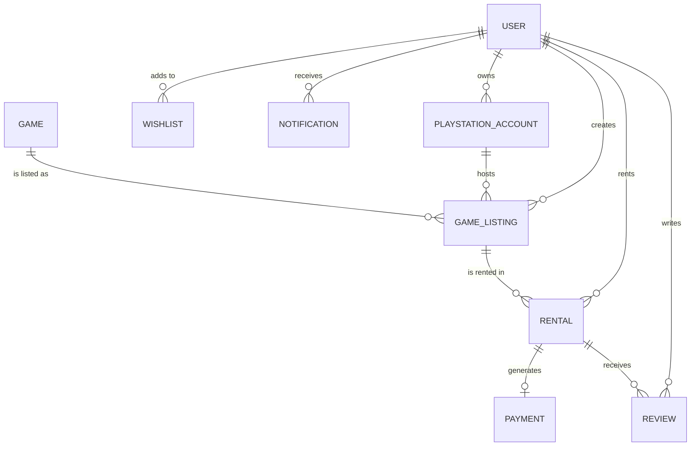

# RenStation Domain Model & Architecture

## Overview
RenStation is a scalable online marketplace for renting PlayStation digital games. This document outlines the Domain-Driven Design (DDD) of the platform across its microservices architecture.

## Microservices Boundary & Entities

Because the platform is distributed, we strictly enforce bounded contexts. Entities **do not** hold direct object references (`@ManyToOne` with foreign key constraints) to entities living in other microservices. Instead, they store cross-service `UUID` identifiers (e.g., `ownerId`).

### 1. `auth-service`
- **OTP**: Manages Mobile + OTP authentication and tracks verification attempts.

### 2. `user-service`
- **User**: The core user profile. Stores role (ADMIN, EXPERT, CLIENT) and status (ACTIVE, SUSPENDED, etc.). Implements soft deletes (`soft_delete`).

### 3. `game-service`
- **Game**: The global catalog of PlayStation titles.

### 4. `inventory-service`
- **PlayStationAccount**: Accounts submitted by users. References `ownerId`. Tracks expert verification status.
- **GameListing**: Individual rental listings tied to a specific `PlayStationAccount` and `Game` (`gameId`). Tracks `RentalType` (PRIMARY/SECONDARY) and pricing.

### 5. `rental-service`
- **Rental**: Represents an active rental agreement. References `listingId`, `ownerId` (the seller), and `renterId` (the buyer). Tracks lifecycle via `RentalStatus`.

### 6. `payment-service`
- **Payment**: Financial transactions linked to a `Rental` (`rentalId`). Tracks platform fees and owner earnings.

### 7. `review-service`
- **Review**: Ratings and feedback given by renters (`reviewerId`) for a specific `Rental` (`rentalId`).

### 8. `wishlist-service`
- **Wishlist**: Users (`userId`) saving games (`gameId`) for later.

### 9. `notification-service`
- **Notification**: Alerts delivered to a `userId`.

## Entity Relationship Diagram

## Recommended Indexes
To ensure high query performance across the microservices, the following indexes are implemented in the Flyway SQL scripts:
- `users`: `idx_user_mobile` (UNIQUE on `mobile_number`).
- `games`: `idx_game_title` (on `title`).
- `game_listings`: `idx_listing_status`, `idx_listing_type`, `idx_listing_owner`, `idx_listing_game`.
- `rentals`: `idx_rental_listing`, `idx_rental_renter`, `idx_rental_owner`.
- `payments`: `idx_payment_rental`.
- `reviews`: `idx_review_rental`, `idx_review_reviewer`.
- `notifications`: `idx_notification_user`, `idx_notification_created_at`.

## Validation Constraints
- **Lengths**: Standardized string lengths (`mobile_number` = 20, `full_name` = 100, `title` = 255) to prevent unbounded data types.
- **Nullability**: Critical fields like IDs, prices, types, and status enums are marked `nullable = false`.
- **Monetary Types**: All prices (`rental_price`, `security_deposit`, `amount`) use `DECIMAL(10,2)` (via `BigDecimal` in Java) for financial accuracy.
- **Dates**: Lifecycle events use `LocalDateTime` tracked automatically via JPA `@CreationTimestamp` and `@UpdateTimestamp`.

## Future Scalability Recommendations
1. **CQRS / Materialized Views**: As the platform grows, the frontend will often need to display a `Rental` alongside the `User` details and the `Game` details. Because these are scattered across services, implement an API Composition pattern in the `api-gateway` or use CQRS with Kafka to stream events to a read-optimized Elasticsearch index.
2. **Event-Driven Architecture**: The transition from `PENDING` to `ACTIVE` in `rental-service` should trigger async events (e.g., via RabbitMQ/Kafka) to `payment-service` to authorize funds, and to `notification-service` to alert the user.
3. **Caching**: Frequently accessed catalog data in `game-service` should be cached using Redis.
4. **Credential Security**: When implementing automated PSN account sharing in the future, `PlayStationAccount` credentials must be stored in a secured Vault (e.g., HashiCorp Vault), strictly segregated from standard databases.
